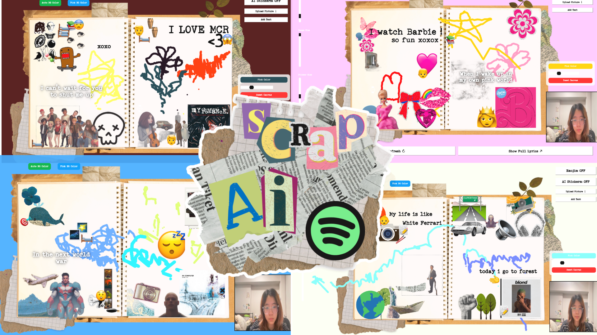

# AI-Powered SpotifyAPI-Scrapbook (24/25)

## Project Overview
This project is an **AI-powered interactive digital scrapbook** that dynamically generates **emojis, AI-generated stickers, and user-drawn elements** based on real-time Spotify lyrics. Using **machine learning models, computer vision, and an interactive UI**, users can create personalised digital scrapbooks by integrating text, gestures, and media elements.



## Video Demo
[🔗  !!! Click here to watch the project demo !!!!](https://youtu.be/utf3sw_DRpA)

## Installation & Setup
### Prerequisites
Ensure you have **Python 3.7+** installed. Then, install the required dependencies:
```sh
pip install -r requirements.txt
```

### Setting Up Spotify API
To enable real-time Spotify lyric fetching, you need **Spotify API credentials**:

1. **Create a Spotify Developer Account**
   - Go to [Spotify Developer Dashboard](https://developer.spotify.com/dashboard)
   - Log in with your Spotify account.
   - Click **Create an App** and fill in the required details.
   - Once created, go to **Settings** to find **Client ID**, **Client Secret**, and **Redirect URI**.

2. **Set Up Environment Variables** (Mac/Linux)
   ```sh
   export SPOTIPY_CLIENT_ID="your-client-id"
   export SPOTIPY_CLIENT_SECRET="your-client-secret"
   export SPOTIPY_REDIRECT_URI="http://localhost:8888/callback"
   ```
   On Windows (PowerShell):
   ```powershell
   $env:SPOTIPY_CLIENT_ID="your-client-id"
   $env:SPOTIPY_CLIENT_SECRET="your-client-secret"
   $env:SPOTIPY_REDIRECT_URI="http://localhost:8888/callback"
   ```

3. **Verify API Setup**
   Run the following command to check if the API credentials are correctly set:
   ```sh
   python -c "import os; print(os.getenv('SPOTIPY_CLIENT_ID'))"
   ```
   If the output is `None`, double-check your **Client ID and Secret**.

### Running the Project
1. Clone the repository:
   ```sh
   git clone https://git.arts.ac.uk/24006698/Pearl-AI-4-Media-Spotify-Scrapbook.git
   cd Pearl-AI-4-Media-Spotify-Scrapbook
   ```
2. Run the application:
   ```sh
   python GUI.py
   ```

### Running as a Standalone Application
To package the application as an executable:
```sh
pyinstaller --windowed --name GUI GUI.py
```
This will create a **standalone app** in the `dist` folder.

## Features
✅ Fetches real-time **Spotify lyrics** via API  
✅ **AI-generated emojis** and **stickers** using NLP & ML  
✅ **Gesture-based drawing** using **MediaPipe & OpenCV**  
✅ **Customizable scrapbook** (text, images, backgrounds)  
✅ **Automatic background removal** for uploaded images  
✅ **Intuitive PyQt6 GUI** for a smooth user experience  

## Dependencies
The following libraries are required and listed in `requirements.txt`:
- PyQt6
- Spotipy
- Transformers
- MediaPipe
- OpenCV
- Hugging Face API
- Rembg (for background removal)

## Notes
- Ensure you have a **valid Spotify API key**.
- If deploying as an **executable app**, bundle the necessary assets.

## License
This project is for **educational and personal use only**. Follow the **ACM Code of Ethics** regarding data privacy and content usage.

---
